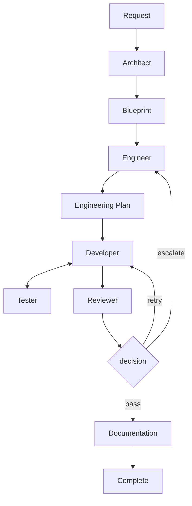

# SmallWorks

Supervised software factory: frontier models decide and rescue, self-hosted models execute.

**Status:** Draft v0.1 — repo skeleton plus control-layer schemas and configs.
Normative spec: `docs/spec/SmallWorks-InitialSystemSpecification.md`.

## Hypothesis

> Small models produce substantially better software when task complexity, context
> size, tool output, and responsibilities are deliberately constrained by the
> surrounding system.

Strong models decide broadly · small models do bounded work · tools provide precise
context · deterministic systems verify results · humans retain control.

## How it works



Each worker receives a fresh **Context Packet** (goal, module contract, relevant
symbols, related tests, coding rules) — never full project history. Workers report
back as concise structured artefacts. Independent modules execute concurrently across
self-hosted and frontier models. Compression stack: Serena (symbols, not files), RTK (shell
output), Repomix (repo overview for Architect/Engineer only), Caveman (reports).

## Factory autonomy (supervised)

SmallWorks runs as a supervised factory: routine work is autonomous within
`configs/factory.yaml` bounds. Frontier models decide and rescue; self-hosted
models execute; cost/time budgets and human approval gates (blueprint, release,
escalation, security, budget) keep it supervised. Self-hosted failures retry
locally, then escalate tiers; humans approve gates, not every step.

## Stack

| Capability | Component |
|---|---|
| Workflow orchestration | TAKT |
| Agent runtime | Pi |
| Model gateway | LiteLLM |
| Local serving | Ollama and/or vLLM |
| Code structure/retrieval | Serena |
| Terminal compression | RTK |
| Repository overview | Repomix |
| Concise agent communication | Caveman |
| Decision routing (Phase 2) | Clef/Jev |
| Task board | GitHub Issues + Projects |
| Source isolation | Git worktrees |

## Roles

| Role | Input → Output | Model tier |
|---|---|---|
| Orchestrator | objectives → work requests, routing | frontier (strong) |
| Architect (Phase 2) | idea → Blueprint | frontier (strong reasoning) |
| Engineer | Blueprint module → EngineeringPlan | self-hosted 12–30B, frontier on retry |
| Developer | bounded task → patch | self-hosted 8–14B, frontier on retry |
| Tester | acceptance criteria → TestReport | self-hosted 8–14B |
| Reviewer | plan + patch + tests → pass / retry / escalate | self-hosted, frontier breaks ties |
| Technical Writer | patch → docs | self-hosted ~8B |

Workers use **logical model groups** (`coder_fast`, `strong_reasoning`, …), never
provider IDs — see `configs/models.yaml`. Order inside each group is preference:
frontier-first for decisions, self-hosted-first for execution.

## Repo layout

```text
src/smallworks/   control layer (cli.py, config.py, context.py, gateway.py,
                  logging.py, schemas.py, service.py, store.py, adapters/,
                  workers/ role prompts, workflow.py TAKT loop, worktrees.py)
configs/          models.yaml (group routing), workers.yaml (roles), factory.yaml (autonomy)
logs/             loguru file sink (smallworks.log, gitignored, ./logs:/app/logs in compose)
docs/spec/        system specification (normative)
docs/plans/       phased implementation plans
tests/            contract/behaviour tests
```

## Quickstart

```sh
uv sync
uv run smallworks info
uv run smallworks validate-config
uv run pytest
```

## Container (podman / docker)

```sh
podman-compose up --build        # or: podman compose up --build
open http://localhost:8000       # runs list + orchestrator chat
```

API: `GET /api/runs`, `GET /api/runs/{id}`, `GET/POST /api/runs/{id}/chat`.
`configs/` is mounted read-only so model/worker/factory tuning needs no rebuild.

## Configuration

- `configs/models.yaml` — logical groups → deployments with `class`
  (`frontier` / `self-hosted`); order is preference: frontier-first for
  decisions, self-hosted-first for execution, fallback across the group.
- `configs/workers.yaml` — role → model group, tier, and concurrency bounds (GPU
  memory, rate limits, cost budgets, dependencies).
- `configs/factory.yaml` — supervised-autonomy policy: tier rules, escalation
  (`max_retries` before climbing tiers), human approval gates, hard budgets.

## Gateway (Phase 02)

`src/smallworks/gateway.py` routes each role through its group in declared
order, retrying to the next deployment (capped by `factory.max_retries`),
bounding concurrency by `workers.yaml max_concurrent`, and pausing with
`BudgetExceeded` when cost/wall-clock exceeds factory budgets. One interface
covers Ollama, vLLM, and frontier-behind-LiteLLM (all OpenAI-compatible
`POST {base}/chat/completions`); endpoints come from `OLLAMA_BASE_URL`,
`VLLM_BASE_URL`, `LITELLM_PROXY_URL`. Every success returns model, provider,
class, tokens, cost, latency, attempts for later `RunReport`.

## Context (Phase 03)

`src/smallworks/context.py` builds fresh `ContextPacket`s (goal, contract,
symbols, tests, rules) under a char budget (default 8 000): progressive
disclosure summary → symbols → source → file, overflow truncated with `ref:`
pointers. Developer packets never include Repomix repo dumps. Adapters in
`src/smallworks/adapters/`: `serena.py` (symbols/references/callers, not
files), `repomix.py` (repo overview, Architect/Engineer only), `rtk.py`
(head+tail compression, raw kept in `RecallStore`, ref surfaces as
`TestReport.raw_output_ref`), `caveman.py` (structured status/reason/next,
no prose).

## Workflow (Phase 04)

`src/smallworks/workflow.py` runs the supervised dev loop per task: request →
engineer → plan → develop (git-worktree isolated) ↔ test → review → gated
decision (`pass` / `retry` / `escalate` via `validate_decision`) → write →
done. Retry loops back to develop, bounded by `factory.max_retries`; spent
budget, reviewer `ESCALATE`, or budget breach escalates to a human.
Independent modules run concurrently via `run_workflow` (thread pool, same
gated sequence per task). Role prompts live in `src/smallworks/workers/`:
engineer (tasks JSON), developer (patch JSON, allowed-files only),
tester (independent report JSON), reviewer (PASS/RETRY/ESCALATE JSON), writer
(docs text). Orchestrator routes only — it has no code-writing prompt.

## Supervision (Phase 05)

Board is GitHub Issues + Projects, not a custom dashboard:
`src/smallworks/board.py` renders `BoardRecord` (§10 fields: status, role,
model, dependencies, attempt, test status, latest report, artefacts,
cost/tokens) to an Issue body and syncs via `gh`. Human controls are workflow
inputs (`supervision.apply_control`: pause, cancel, retry, escalate,
change-model, send-back-to-Engineer, instruct, approve/reject) applied to run
state via the store or `POST /api/runs/{id}/control` (buttons in the UI).
Every run emits a §12 `RunReport` (worker, model, provider, tokens, cost,
context sources, tool calls, result, artefacts), persisted as JSON.
CLI: `status [run]`, `logs <run> [--raw]` (RTK-compressed, raw via ref),
`cost <task>`.

## Logging

Loguru, DEBUG by default, rich from the first line: stderr (color) + rotating
file (`logs/smallworks.log`, 10 MB / 7 days, gitignored). Every record carries
bound context (`component`, `task_id`, `role`, `deployment`, …). Flags:
`--log-level`, `--log-file`; env `SMALLWORKS_LOG_LEVEL`,
`SMALLWORKS_LOG_DIR`. Check `logs/smallworks.log` first when investigating.

## Evaluation (Phase 06)

`src/smallworks/eval/` pins a fixture task set and runs two arms: Baseline
(one large model, full-repo context) vs SmallWorks (real gated
`run_workflow` loop with bounded packets). Every §13 metric is captured per
arm — completion, tests, retries, human interventions, regressions, tokens,
wall-clock/GPU time, API cost, context chars, escalations — from `RunReport`s
plus test results. `compare` renders side-by-side rows with a hypothesis
verdict (`SUPPORTED` when SmallWorks completes at least as much with lower
cost or context); `save_report`/`load_report` persist comparison + raw
outputs so a re-run reproduces the verdict. Deterministic: seeded retries,
isolated worktrees per attempt. Findings feed plan 07; no auto-tuning here.

## MVP scope / non-goals

MVP: TAKT + Pi + LiteLLM + Ollama/vLLM + RTK + Serena + Repomix, Engineer/Developer/
Tester/Reviewer roles, Git worktrees, GitHub Issues/Projects, structured artefacts,
basic telemetry. NOT building: custom web UI, long-term semantic memory, autonomous
PR merging, agent societies. Architect role and Clef/Jev routing are Phase 2.
