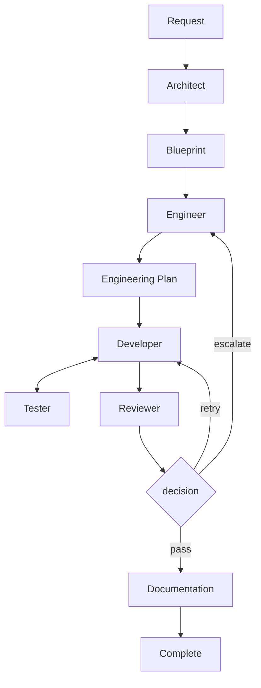

# SmallWorks

Supervised software factory: frontier models decide and rescue, self-hosted models execute.

**Status:** Draft v0.1 — repo skeleton plus control-layer schemas and configs.
Normative spec: `docs/spec/SmallWorks-InitialSystemSpecification.md`.

## Hypothesis

> Small models produce substantially better software when task complexity, context
> size, tool output, and responsibilities are deliberately constrained by the
> surrounding system.

Strong models decide broadly · small models do bounded work · tools provide precise
context · deterministic systems verify results · humans retain control.

## How it works



Each worker receives a fresh **Context Packet** (goal, module contract, relevant
symbols, related tests, coding rules) — never full project history. Workers report
back as concise structured artefacts. Independent modules execute concurrently across
self-hosted and frontier models. Compression stack: Serena (symbols, not files), RTK (shell
output), Repomix (repo overview for Architect/Engineer only), Caveman (reports).

## Factory autonomy (supervised)

SmallWorks runs as a supervised factory: routine work is autonomous within
`configs/factory.yaml` bounds. Frontier models decide and rescue; self-hosted
models execute; cost/time budgets and human approval gates (blueprint, release,
escalation, security, budget) keep it supervised. Self-hosted failures retry
locally, then escalate tiers; humans approve gates, not every step.

## Stack

| Capability | Component |
|---|---|
| Workflow orchestration | TAKT |
| Agent runtime | Pi |
| Model gateway | LiteLLM |
| Local serving | Ollama and/or vLLM |
| Code structure/retrieval | Serena |
| Terminal compression | RTK |
| Repository overview | Repomix |
| Concise agent communication | Caveman |
| Decision routing (Phase 2) | Clef/Jev |
| Task board | GitHub Issues + Projects |
| Source isolation | Git worktrees |

## Roles

| Role | Input → Output | Model tier |
|---|---|---|
| Orchestrator | objectives → work requests, routing | frontier (strong) |
| Architect (Phase 2) | idea → Blueprint | frontier (strong reasoning) |
| Engineer | Blueprint module → EngineeringPlan | self-hosted 12–30B, frontier on retry |
| Developer | bounded task → patch | self-hosted 8–14B, frontier on retry |
| Tester | acceptance criteria → TestReport | self-hosted 8–14B |
| Reviewer | plan + patch + tests → pass / retry / escalate | self-hosted, frontier breaks ties |
| Technical Writer | patch → docs | self-hosted ~8B |

Workers use **logical model groups** (`coder_fast`, `strong_reasoning`, …), never
provider IDs — see `configs/models.yaml`. Order inside each group is preference:
frontier-first for decisions, self-hosted-first for execution.

## Repo layout

```text
src/smallworks/   control layer (cli.py, config.py, schemas.py, service.py, store.py)
configs/          models.yaml (group routing), workers.yaml (roles), factory.yaml (autonomy)
docs/spec/        system specification (normative)
docs/plans/       phased implementation plans
tests/            contract/behaviour tests
```

## Quickstart

```sh
uv sync
uv run smallworks info
uv run smallworks validate-config
uv run pytest
```

## Container (podman / docker)

```sh
podman-compose up --build        # or: podman compose up --build
open http://localhost:8000       # runs list + orchestrator chat
```

API: `GET /api/runs`, `GET /api/runs/{id}`, `GET/POST /api/runs/{id}/chat`.
`configs/` is mounted read-only so model/worker/factory tuning needs no rebuild.

## Configuration

- `configs/models.yaml` — logical groups → deployments with `class`
  (`frontier` / `self-hosted`); order is preference: frontier-first for
  decisions, self-hosted-first for execution, fallback across the group.
- `configs/workers.yaml` — role → model group, tier, and concurrency bounds (GPU
  memory, rate limits, cost budgets, dependencies).
- `configs/factory.yaml` — supervised-autonomy policy: tier rules, escalation
  (`max_retries` before climbing tiers), human approval gates, hard budgets.

## Evaluation

Baseline (one frontier model on the repo) vs SmallWorks (frontier-led,
self-hosted execution) on: task completion, tests passed, retries, human
interventions, regressions, tokens, wall-clock/GPU time, API cost, context
size, escalation frequency. Every run records a `RunReport` (§12) — worker, model,
tokens, cost, context sources, tool calls, result.

## MVP scope / non-goals

MVP: TAKT + Pi + LiteLLM + Ollama/vLLM + RTK + Serena + Repomix, Engineer/Developer/
Tester/Reviewer roles, Git worktrees, GitHub Issues/Projects, structured artefacts,
basic telemetry. NOT building: custom web UI, long-term semantic memory, autonomous
PR merging, agent societies. Architect role and Clef/Jev routing are Phase 2.
